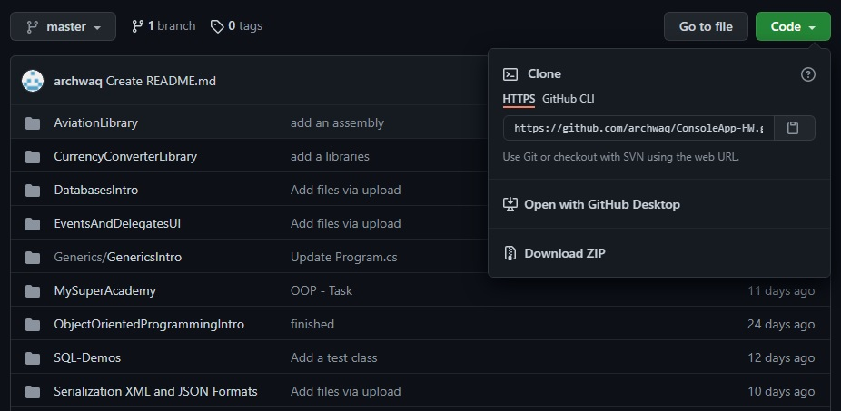

# Overview

The purpose of this repository is to give you the opportunity to meet with my source code.
Academy material I've been through and remade to a fresh date.

# Features

 - Serialization/Deserialization. Working with XML and JSON objects.
 - ADO.NET Database accessing and processing.
 - MySql CRUD operations.
 - Demonstration of Stack, Queue, List, Dictonary.
 - Events and delegates.
 - Principles of Object Oriented Programming.
 - Additional task (which is a must) - MySuperAcademy. 
 - Elements of the class. Static fields and methods.
 - Vectors, Matrices, Arrays.
 - Conditional statements -if-else, switch.
 - Loops -for, foreach, while, do-while.
 - Arithmetic and logical operators.
 - Data types. User input including validations.
 
Prerequisites:

 - Beginner level of C#
 - Local installation of [Visual Studio] (https://visualstudio.microsoft.com/downloads/)

Instructions (for those unfamiliar with Git)

First of all to download the files just click on Code (watch example). You'll have 2 options download a zipper or use [GitHub Desktop] (https://desktop.github.com/)
(if you want to keep the folder updated: (https://docs.github.com/en/desktop/contributing-and-collaborating-using-github-desktop/keeping-your-local-repository-in-sync-with-github/syncing-your-branch))

